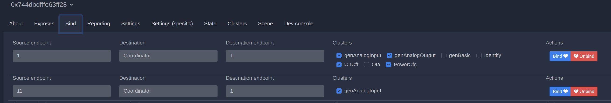

# Zigbee Air Freshener with ESP32-H2

## Overview
This project aims to customize and integrate an **Air Wick air freshener** into a smart home system using the Zigbee protocol. The modification allows remote control and automation of the air freshener via **Zigbee2MQTT**.

## Requirements

### Hardware
- **Air Freshener** ([Official Website](https://www.airwick.co.uk/products/automatic-sprays/spring-delight))
- **ESP32-H2 Supermini** ([Buy on AliExpress](https://www.aliexpress.com/w/wholesale-esp32h2-supermini.html?spm=a2g0o.productlist.search.0))
- **Li-ion 14500 3.7V Battery**
- **Two 300kΩ Resistors**

<p align="center">    </p>

### Tools
- **Drill & Drill Bits**
- **Wires**
- **Soldering Iron**

## Modifications
A detailed guide on disassembling the Air Wick device and making the necessary modifications can be found **[here](docs/airwick_mod.md)**.

## Installation
## Build


This project can be built with the [ESP-IDF build system](https://docs.espressif.com/projects/esp-idf/en/latest/esp32/api-guides/build-system.html)

Configure:

    idf.py set-target esp32h2

Build:

    idf.py build

Flash::

    idf.py flash

### Zigbee2MQTT
This project is supported via an **external converter**. To integrate it into **Zigbee2MQTT**, follow these steps:

```bash
cp proj_dir/z2m/air_wick.js zigbee2mqtt_dir/data
vi configuration.yaml
```

Add the following line to `configuration.yaml`:

```yaml
external_converters:
  - air_wick.js
```

Save the file and restart **Zigbee2MQTT** to apply changes.

Once the device is paired successfully, make sure to check the **Bind** tab. The settings should appear as shown in the screenshot.  
<p align="left"> </p>
Additionally, check the **Reports** tab and ensure that all reports are disabled.
<p align="left"> </p>
## License
This project is open-source and distributed under the **MIT License**.


