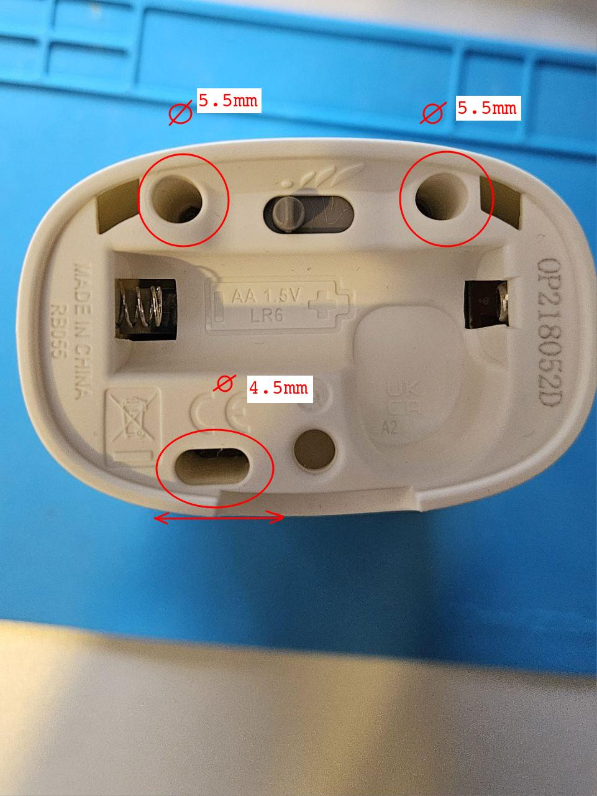
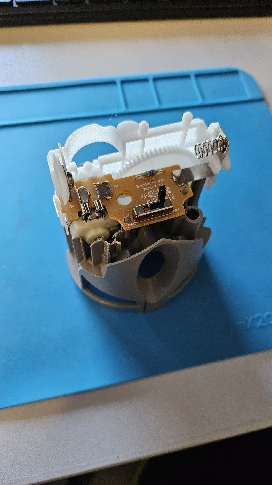
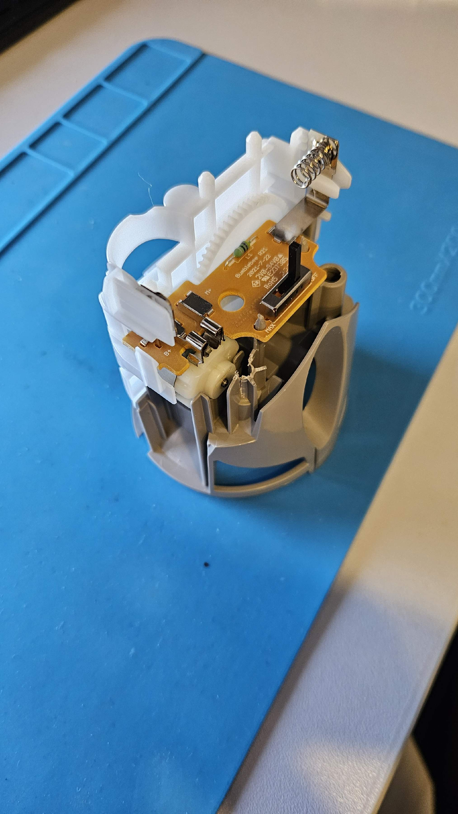
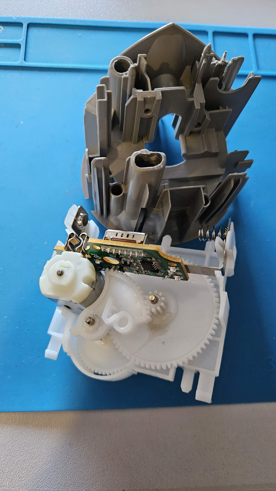
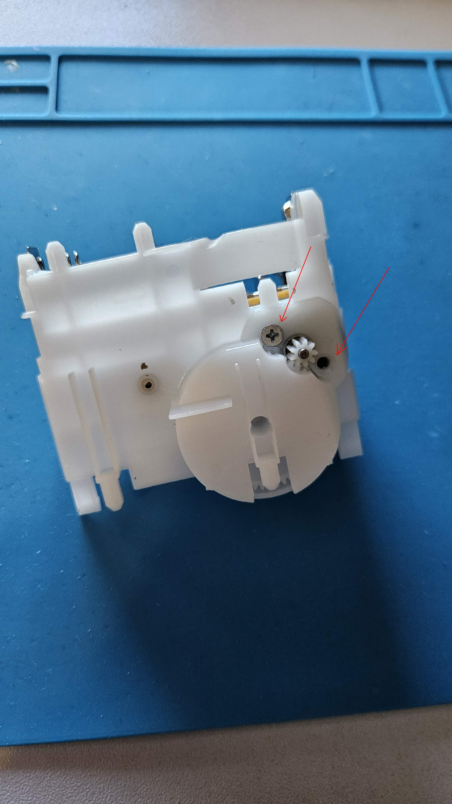
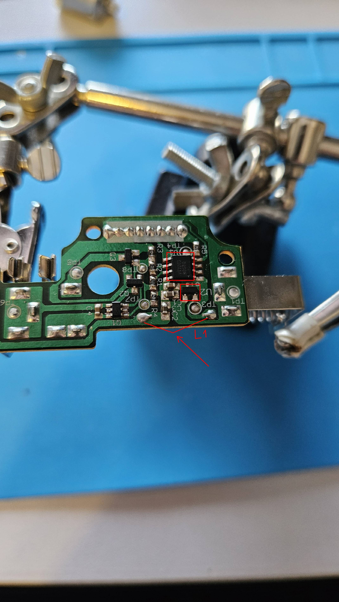
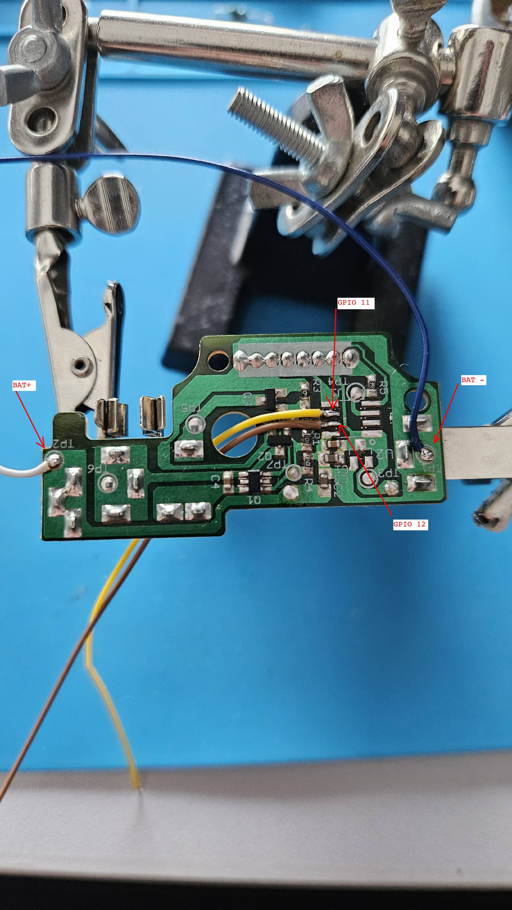
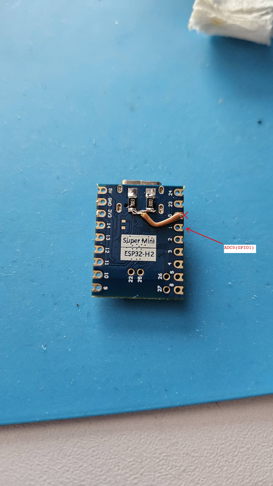
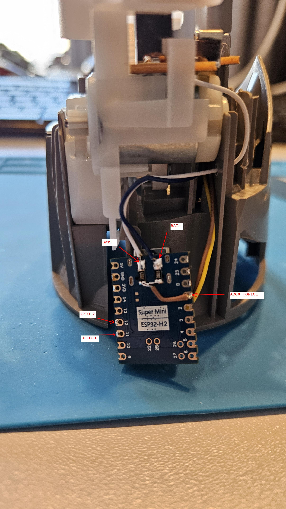
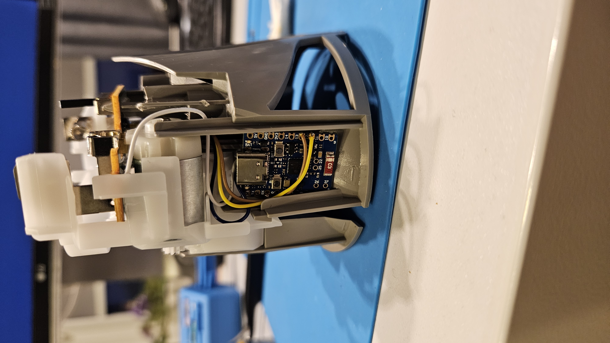

# Air Wick Disassembly and Modification Guide  

## Tools Needed  
- Drill and drill bits (diameters: 5.5mm and 4.5mm)  
- Soldering iron and solder  
- Small screwdriver  
- Wires  
- Resistors (SMD 1206, 300KΩ, ±1%)  

## Step 1: Disassembling the Air Wick  
1. Drill three mounting points at the top of the device (refer to the photo).  
  
 
 
2. Carefully remove the internal block. It may require some force to extract.  
  
  
   

## Step 2: Removing the Motor and Circuit Board  
1. Unscrew the motor and detach the circuit board. Be careful not to lose the gears.  
   
 
  
2. On the circuit board, desolder specific components, including the L1 coil on the backside.  
   
 
  

## Step 3: Wiring the Circuit Board  
1. Solder the necessary wires to the board.
  
 
  
2. Reinstall the circuit board and motor back.  
 

## Step 4: Setting Up the ESP32-H2 Board  
1. Build a voltage divider for ADC using two 300KΩ SMD 1206 ±1% resistors.  
   
 
  
2. Solder the necessary wires to the ESP32-H2 board.
  
 

  

3. Install the battery and enable pairing mode in **zigbee2mqtt** . After installing the battery, the device will automatically enter pairing mode. You can confirm this by the LED indicator blinking. Once the pairing process is complete, the LED will turn off.
4. After successful pairing and testing, reassemble the device.  

---

### Additional Notes  
- Ensure proper soldering to avoid loose connections.  
- Double-check polarity when connecting the battery.  
- If you experience issues with pairing, try resetting the ESP32-H2 module and pairing again.  
- Holding the **BOOT** button for approximately **1.5 seconds** will reset the device and put it into pairing mode.   
